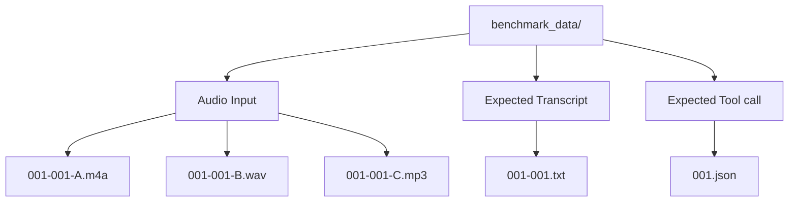

# VoiceRecorderSample Benchmark

## Overview

Benchmark mode is available only in `BENCHMARK_BUILD`. When `benchmark_enabled` is true, the app runs bundled benchmark WAV, MP3, or M4A files in a loop, waits 10 seconds between inference runs, and reports one WildEdge inference event per measured inference.

The benchmark input set is controlled by the SDK config payload. The app uses the currently effective STT model/settings from the same payload or local settings.

## Dataset Layout

Benchmark files live in:

`Examples/VoiceRecorderSample/benchmark_data/`

Each recording uses this identifier:

`<line_id>-<variant_id>-<speaker_id>`

Example:

`001-001-A.wav`

This means:

- `001`: benchmark line ID
- `001`: phrase variant ID
- `A`: speaker ID

Expected files are shared where possible:

- `001-001-A.wav`, `001-001-A.mp3`, or `001-001-A.m4a`: input recording for line 001, variant 001, speaker A
- `001-001-A.wav`: optional preprocessed WAV sidecar used for inference when the source input is `001-001-A.m4a` or `001-001-A.mp3`
- `001-001.txt`: expected exact transcript for line 001, variant 001, shared by speakers
- `001.json`: expected exact tool call for line 001, shared by variants and speakers



The file tree for that same example is:

```text
benchmark_data/
├── 001-001-A.m4a      # speaker A audio input
├── 001-001-A.wav      # optional preprocessed inference input
├── 001-001-B.wav      # speaker B audio input
├── 001-001-C.mp3      # speaker C audio input
├── 001-001.txt        # expected transcript for line 001, variant 001
└── 001.json           # expected tool call for line 001
```

## Dataset Assumptions

| Category | Line ID | Variant ID | Phrase | Recording IDs | Expected Transcript | Expected Tool Call |
| --- | --- | --- | --- | --- | --- | --- |
| climate | 001 | 001 | set temperature to 21 degrees | 001-001-A/B/C.wav/.mp3/.m4a | 001-001.txt | 001.json |
| climate | 001 | 002 | set temperature to 21 degrees, please | 001-002-A/B/C.wav/.mp3/.m4a | 001-002.txt | 001.json |
| climate | 001 | 003 | temperature 21 degrees | 001-003-A/B/C.wav/.mp3/.m4a | 001-003.txt | 001.json |
| radio | 002 | 001 | volume down | 002-001-A/B/C.wav/.mp3/.m4a | 002-001.txt | 002.json |
| radio | 002 | 002 | hey, volume down | 002-002-A/B/C.wav/.mp3/.m4a | 002-002.txt | 002.json |
| radio | 002 | 003 | its too loud, volume down | 002-003-A/B/C.wav/.mp3/.m4a | 002-003.txt | 002.json |
| nav | 003 | 001 | navigate home, please | 003-001-A/B/C.wav/.mp3/.m4a | 003-001.txt | 003.json |
| nav | 003 | 002 | navigate home, now | 003-002-A/B/C.wav/.mp3/.m4a | 003-002.txt | 003.json |
| nav | 003 | 003 | let's go home | 003-003-A/B/C.wav/.mp3/.m4a | 003-003.txt | 003.json |

## SDK Config Selection

The SDK payload controls which benchmark inputs run.

Recommended structured payload:

```json
{
  "app_settings": {
    "benchmark_mode": true
  },
  "benchmark_params": {
    "delay_seconds": 10,
    "number_of_inferences": 10,
    "recordings_match": "*"
  },
  "model_settings": {
    "model_name": "whisper-tiny"
  },
  "sdk_settings": {
    "config_fetch": "30s"
  }
}
```

To focus on particular input audio files, set `recordings_match` to recording ID patterns:

```json
{
  "app_settings": {
    "benchmark_mode": true
  },
  "benchmark_params": {
    "delay_seconds": 10,
    "number_of_inferences": 10,
    "recordings_match": [
      "001*",
      "^003-003-[AC]$"
    ]
  },
  "model_settings": {
    "model_name": "whisper-tiny"
  },
  "sdk_settings": {
    "config_fetch": "30s"
  }
}
```

This runs matching bundled audio files one by one, for example:

- `benchmark_data/001-001-A.wav`
- `benchmark_data/001-001-B.wav`
- `benchmark_data/001-001-C.m4a`
- `benchmark_data/001-002-A.wav`
- `benchmark_data/003-003-A.wav`
- `benchmark_data/003-003-C.wav`

Selection rules:

- `app_settings.benchmark_mode: true` starts the benchmark loop.
- `app_settings.benchmark_mode: false` stops the loop after the current file finishes.
- `benchmark_params.recordings_match: "*"` runs all available WAV, MP3, and M4A files.
- `benchmark_params.recordings_match` filters by recording ID, filename, or bundle path.
- `recordings_match` supports wildcard patterns such as `001*`; explicit regular expressions such as `^003-003-[AC]$` are also supported.
- `benchmark_params.delay_seconds` controls the wait between runs and defaults to 10.
- `benchmark_params.number_of_inferences` controls how many measured speech-to-text inferences run for each selected audio file before advancing to the next file. It defaults to 1.
- `model_settings.model_name` selects the STT model; examples are `apple-speech`, `whisper-tiny`, `whisper-base`, and `leap-lfm2.5-audio-1.5b`.
- `sdk_settings.config_fetch` controls how often the app refreshes the SDK payload; values can be seconds as a number or strings like `30s`.
- Missing audio files are skipped.

## Run Behavior

For each selected WAV, MP3, or M4A file, the app:

1. Injects the bundled audio file URL into the current speech-to-text processing flow.
2. Prepares the processing audio file before measurement, converting M4A to a temporary WAV when possible.
3. Runs `benchmark_params.number_of_inferences` measured inferences for that processing file.
4. Records the benchmark file ID and run index in WildEdge metadata.
5. Loads the expected transcript from `<line_id>-<variant_id>.txt`.
6. Records the expected tool-call file reference from `<line_id>.json` when present.
7. Emits transcript comparison metadata, including normalized exact match and WER.
8. Waits `benchmark_params.delay_seconds`, defaulting to 10 seconds, between measured inferences.
9. Continues with the next selected file until benchmark mode is disabled.

Benchmark runs do not upload benchmark WAV/MP3/M4A files or transcript `.txt` files as attachments. The event metadata refers to the bundled dataset files by name instead.

The benchmark status panel shows the current input file, preprocessing file, inference run index, latest latency/result, and a live countdown during the configured sleep before the next benchmark run.

M4A benchmark files are converted to temporary WAV files before the benchmark loop starts. That conversion is a preparation step, so conversion time is not included in the speech-to-text inference duration.

## WildEdge Metadata

Each benchmark inference should include enough metadata to identify the run without uploading the source dataset file.

Input metadata should include:

- `benchmark_enabled`
- `source`
- `benchmark_file`
- `benchmark_recording_id`
- `input_data_name`
- `input_data_file`
- `preprocessing_file`
- `processing_audio_extension`
- `converted_to_wav_before_inference`
- `benchmark_line_id`
- `benchmark_variant_id`
- `benchmark_speaker_id`
- `benchmark_delay_seconds`
- `benchmark_number_of_inferences`
- `benchmark_recordings_match`
- `benchmark_audio_extension`
- `expected_transcript_file`
- `expected_tool_call_file`
- `benchmark_iteration`
- `benchmark_inference_index`
- `benchmark_inference_count`
- selected STT model/settings

Output metadata should include:

- `transcript`
- `expected_transcript`
- `normalized_transcript`
- `normalized_expected_transcript`
- `normalized_exact_match`
- `wer`
- duration fields already reported by the processing flow

Each benchmark speech-to-text inference is tracked inside a WildEdge span named after the input audio file, for example `001-001-A.wav`.

## Current Scope

The first benchmark version measures speech-to-text only.

`<line_id>.json` is included as the future expected tool-call reference for speech-to-tools and text-to-tools benchmarking, but v1 does not evaluate tool-call accuracy.
