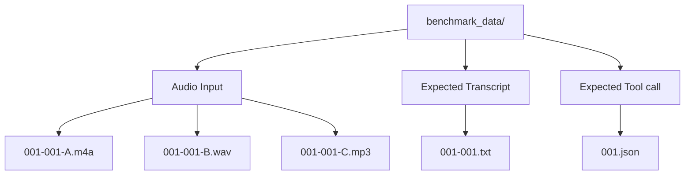

# VoiceRecorderSample Benchmark

## Overview

Benchmark mode is available only in `BENCHMARK_BUILD`. When `benchmark_enabled` is true, the app runs bundled benchmark WAV, MP3, or M4A files in a loop, waits 10 seconds between benchmark runs, and reports WildEdge inference events for each measured model step.

The benchmark input set and step sequence are controlled by the SDK config payload. The app uses the currently effective STT model/settings from the same payload or local settings when a run includes `speech_to_text`.

## Dataset Layout

Benchmark files live in:

`Examples/VoiceRecorderSample/benchmark_data/`

Each recording uses this identifier:

`<line_id>-<variant_id>-<speaker_id>`

Example:

`001-001-A.wav`

This means:

- `001`: benchmark line ID
- `001`: phrase variant ID
- `A`: speaker ID

Expected files are shared where possible:

- `001-001-A.wav`, `001-001-A.mp3`, or `001-001-A.m4a`: input recording for line 001, variant 001, speaker A
- `001-001-A.wav`: optional preprocessed WAV sidecar used for inference when the source input is `001-001-A.m4a` or `001-001-A.mp3`
- `001-001.txt`: expected exact transcript for line 001, variant 001, shared by speakers
- `001.json`: expected exact tool call for line 001, shared by variants and speakers



The file tree for that same example is:

```text
benchmark_data/
├── 001-001-A.m4a      # speaker A audio input
├── 001-001-A.wav      # optional preprocessed inference input
├── 001-001-B.wav      # speaker B audio input
├── 001-001-C.mp3      # speaker C audio input
├── 001-001.txt        # expected transcript for line 001, variant 001
└── 001.json           # expected tool call for line 001
```

## Dataset Assumptions

Plain Markdown tables cannot merge cells. This table uses raw HTML so the line-level expected tool call can be shown once with `rowspan`.

<table>
  <thead>
    <tr>
      <th>Category</th>
      <th>Line ID</th>
      <th>Variant ID</th>
      <th>Phrase</th>
      <th>Expected Tool Call</th>
      <th>Recording IDs</th>
      <th>Expected Transcript</th>
      <th>Expected Tool Call File</th>
    </tr>
  </thead>
  <tbody>
    <tr>
      <td rowspan="3">climate</td>
      <td rowspan="3"><code>001</code></td>
      <td><code>001</code></td>
      <td>set temperature to 21 degrees</td>
      <td rowspan="3">
        <pre><code>{
  "tool_name": "set_temperature",
  "arguments": {
    "temperature": 21
  }
}</code></pre>
      </td>
      <td><code>001-001-A/B/C.wav/.mp3/.m4a</code></td>
      <td><code>001-001.txt</code></td>
      <td rowspan="3"><code>001.json</code></td>
    </tr>
    <tr>
      <td><code>002</code></td>
      <td>set temperature to 21 degrees, please</td>
      <td><code>001-002-A/B/C.wav/.mp3/.m4a</code></td>
      <td><code>001-002.txt</code></td>
    </tr>
    <tr>
      <td><code>003</code></td>
      <td>temperature 21 degrees</td>
      <td><code>001-003-A/B/C.wav/.mp3/.m4a</code></td>
      <td><code>001-003.txt</code></td>
    </tr>
    <tr>
      <td rowspan="3">radio</td>
      <td rowspan="3"><code>002</code></td>
      <td><code>001</code></td>
      <td>volume down</td>
      <td rowspan="3">
        <pre><code>{
  "tool_name": "change_volume",
  "arguments": {
    "direction": "down"
  }
}</code></pre>
      </td>
      <td><code>002-001-A/B/C.wav/.mp3/.m4a</code></td>
      <td><code>002-001.txt</code></td>
      <td rowspan="3"><code>002.json</code></td>
    </tr>
    <tr>
      <td><code>002</code></td>
      <td>hey, volume down</td>
      <td><code>002-002-A/B/C.wav/.mp3/.m4a</code></td>
      <td><code>002-002.txt</code></td>
    </tr>
    <tr>
      <td><code>003</code></td>
      <td>its too loud, volume down</td>
      <td><code>002-003-A/B/C.wav/.mp3/.m4a</code></td>
      <td><code>002-003.txt</code></td>
    </tr>
    <tr>
      <td rowspan="3">nav</td>
      <td rowspan="3"><code>003</code></td>
      <td><code>001</code></td>
      <td>navigate home, please</td>
      <td rowspan="3">
        <pre><code>{
  "tool_name": "navigate",
  "arguments": {
    "destination": "home"
  }
}</code></pre>
      </td>
      <td><code>003-001-A/B/C.wav/.mp3/.m4a</code></td>
      <td><code>003-001.txt</code></td>
      <td rowspan="3"><code>003.json</code></td>
    </tr>
    <tr>
      <td><code>002</code></td>
      <td>navigate home, now</td>
      <td><code>003-002-A/B/C.wav/.mp3/.m4a</code></td>
      <td><code>003-002.txt</code></td>
    </tr>
    <tr>
      <td><code>003</code></td>
      <td>let's go home</td>
      <td><code>003-003-A/B/C.wav/.mp3/.m4a</code></td>
      <td><code>003-003.txt</code></td>
    </tr>
  </tbody>
</table>

## SDK Config Selection

The SDK payload controls which benchmark inputs run.

Recommended structured payload:

```json
{
  "app_settings": {
    "benchmark_mode": true
  },
  "benchmark_params": {
    "benchmark_steps": ["speech_to_text"],
    "delay_seconds": 10,
    "number_of_inferences": 10,
    "recordings_match": "*"
  },
  "model_settings": {
    "model_name": "whisper-tiny"
  },
  "sdk_settings": {
    "config_fetch": "30s"
  }
}
```

Two-step speech-to-tool payload:

```json
{
  "app_settings": {
    "benchmark_mode": true
  },
  "benchmark_params": {
    "benchmark_steps": ["speech_to_text", "text_to_tool"],
    "delay_seconds": 10,
    "number_of_inferences": 10,
    "recordings_match": "*"
  },
  "model_settings": {
    "model_name": "leap-lfm2.5-audio-1.5b"
  },
  "sdk_settings": {
    "config_fetch": "30s"
  }
}
```

Direct speech-to-tool payload:

```json
{
  "app_settings": {
    "benchmark_mode": true
  },
  "benchmark_params": {
    "benchmark_steps": ["speech_to_tool"],
    "delay_seconds": 10,
    "number_of_inferences": 10,
    "recordings_match": "*"
  },
  "model_settings": {
    "model_name": "leap-lfm2.5-audio-1.5b"
  },
  "sdk_settings": {
    "config_fetch": "30s"
  }
}
```

To focus on particular input audio files, set `recordings_match` to recording ID patterns:

```json
{
  "app_settings": {
    "benchmark_mode": true
  },
  "benchmark_params": {
    "benchmark_steps": ["speech_to_text"],
    "delay_seconds": 10,
    "number_of_inferences": 10,
    "recordings_match": [
      "001*",
      "^003-003-[AC]$"
    ]
  },
  "model_settings": {
    "model_name": "whisper-tiny"
  },
  "sdk_settings": {
    "config_fetch": "30s"
  }
}
```

This runs matching bundled audio files one by one, for example:

- `benchmark_data/001-001-A.wav`
- `benchmark_data/001-001-B.wav`
- `benchmark_data/001-001-C.m4a`
- `benchmark_data/001-002-A.wav`
- `benchmark_data/003-003-A.wav`
- `benchmark_data/003-003-C.wav`

Selection rules:

- `app_settings.benchmark_mode: true` starts the benchmark loop.
- `app_settings.benchmark_mode: false` stops the loop after the current file finishes.
- `benchmark_params.benchmark_steps` selects benchmark behavior. Missing steps default to `["speech_to_text"]`.
- Supported step sequences are `["speech_to_text"]`, `["speech_to_text", "text_to_tool"]`, and `["speech_to_tool"]`.
- Unsupported step sequences are shown in the benchmark status panel and no benchmark work runs until the SDK config changes.
- Legacy `audio_to_tool_architecture` is only used when `benchmark_steps` is absent: `2step` maps to `["speech_to_text", "text_to_tool"]`; `1step` maps to `["speech_to_tool"]`.
- `benchmark_params.recordings_match: "*"` runs all available WAV, MP3, and M4A files.
- `benchmark_params.recordings_match` filters by recording ID, filename, or bundle path.
- `recordings_match` supports wildcard patterns such as `001*`; explicit regular expressions such as `^003-003-[AC]$` are also supported.
- `benchmark_params.delay_seconds` controls the wait between runs and defaults to 10.
- `benchmark_params.number_of_inferences` controls how many measured benchmark runs execute for each selected audio file before advancing to the next file. It defaults to 1.
- `model_settings.model_name` selects the STT model for STT-including runs; examples are `apple-speech`, `whisper-tiny`, `whisper-base`, and `leap-lfm2.5-audio-1.5b`.
- Tool-call steps currently use Leap LFM2.5 Audio; the two tool-call modes differ by prompt and input modality.
- `sdk_settings.config_fetch` controls how often the app refreshes the SDK payload; values can be seconds as a number or strings like `30s`.
- Missing audio files are skipped.

## Run Behavior

For each selected WAV, MP3, or M4A file, the app:

1. Injects the bundled audio file URL into the current speech-to-text processing flow.
2. Prepares the processing audio file before measurement, converting M4A to a temporary WAV when possible.
3. Runs `benchmark_params.number_of_inferences` measured benchmark runs for that processing file.
4. Records the benchmark file ID and run index in WildEdge metadata.
5. Loads the expected transcript from `<line_id>-<variant_id>.txt`.
6. Loads the expected tool-call JSON from `<line_id>.json`.
7. Executes the selected `benchmark_steps`.
8. Emits transcript comparison metadata for STT-including runs, including normalized exact match and WER.
9. Emits tool-call comparison metadata for tool-call runs, using canonical JSON equality so whitespace and key order do not matter.
10. Waits `benchmark_params.delay_seconds`, defaulting to 10 seconds, between measured benchmark runs.
11. Continues with the next selected file until benchmark mode is disabled.

`["speech_to_text"]` runs the existing STT-only benchmark and compares the produced transcript with the expected transcript fixture.

`["speech_to_text", "text_to_tool"]` first runs the selected STT model, then sends the actual transcript to Leap LFM2.5 Audio with a strict text-to-tool prompt. It compares the resulting JSON object with the expected `<line_id>.json` fixture.

`["speech_to_tool"]` sends the audio directly to Leap LFM2.5 Audio with a speech-to-tool prompt. It compares the resulting JSON object with the expected `<line_id>.json` fixture and does not show transcript fields unless a transcript is produced separately for debugging.

Benchmark runs do not upload benchmark WAV/MP3/M4A files, transcript `.txt` files, or tool-call `.json` files as attachments. The event metadata refers to the bundled dataset files by name instead.

The benchmark status panel shows the selected steps, current input file, preprocessing file, run index, latest latency/result, expected and actual transcript for STT-including runs, expected and actual tool-call JSON for tool-call runs, transcript match, tool-call match, and a live countdown during the configured sleep before the next benchmark run.

M4A benchmark files are converted to temporary WAV files before the benchmark loop starts. That conversion is a preparation step, so conversion time is not included in the speech-to-text inference duration.

## WildEdge Metadata

Each benchmark inference should include enough metadata to identify the run without uploading the source dataset file.

Input metadata should include:

- `benchmark_enabled`
- `benchmark_steps`
- `source`
- `benchmark_file`
- `benchmark_recording_id`
- `input_data_name`
- `input_data_file`
- `recording_duration_seconds`
- `input_audio_duration_seconds`
- `preprocessing_file`
- `processing_audio_extension`
- `processing_audio_duration_seconds`
- `converted_to_wav_before_inference`
- `benchmark_line_id`
- `benchmark_variant_id`
- `benchmark_speaker_id`
- `benchmark_delay_seconds`
- `benchmark_number_of_inferences`
- `benchmark_recordings_match`
- `benchmark_audio_extension`
- `expected_transcript_file`
- `expected_tool_call`
- `expected_tool_call_file`
- `expected_tool_call_json`
- `benchmark_iteration`
- `benchmark_inference_index`
- `benchmark_inference_count`
- selected STT model/settings

Output metadata should include:

- `transcript`
- `expected_transcript`
- `normalized_transcript`
- `normalized_expected_transcript`
- `normalized_exact_match`
- `wer`
- `expected_tool_call`
- `expected_tool_call_json`
- `actual_tool_call`
- `actual_tool_call_json`
- `actual_tool_call_parse_error`
- `tool_call_exact_match`
- `tool_call_step`
- `tool_call_duration_ms`
- `benchmark_total_duration_ms`
- duration fields reported by the processing flow

Each benchmark run is tracked inside a WildEdge span named after the input audio file, for example `001-001-A.wav`. Two-step runs record separate logical model handles for the STT step and the text-to-tool step; direct runs record the speech-to-tool logical model handle.

## Supported Tool Calls

Tool-call benchmarks expect one strict JSON object:

```json
{
  "tool_name": "set_temperature",
  "arguments": {
    "temperature": 21
  }
}
```

The v1 supported tools are:

- `set_temperature` with numeric `temperature`
- `change_volume` with string `direction`
- `navigate` with string `destination`

Expected and actual tool calls are compared by parsed canonical JSON equality. Model output may contain surrounding text or code fences; the benchmark extracts the first JSON object before parsing. The parsed object must use one supported `tool_name`, contain only `tool_name` and `arguments`, and use the expected argument key and value type for that tool.
