# Speech-to-Tool Benchmark

I’m running a benchmark to compare two approaches for turning spoken user intent into tool calls:

1. **Direct, single-step speech-to-tool**
2. **Two-step speech-to-text, then text-to-tool**

The core question is simple:

> Which approach is faster and more practical when running on-device inside an iOS app?

## Why this matters

For voice-first interfaces, latency matters a lot. Even small delays can make an assistant feel less responsive, especially when the goal is to trigger an action rather than produce a long-form answer.

In this benchmark, I want to focus on the fastest possible inference path for short spoken commands.

## Methodology

The benchmark runs inside an iOS app.

Audio is provided as `.m4a` files and converted to the supported format outside of the measured time, so the measured latency focuses on inference and tool-call preparation rather than preprocessing.

This benchmark focuses on latency, not model accuracy. I do not measure the model’s general tool-calling accuracy here. Latency results are reported only for runs where the generated output matches the expected tool call. In this test set, that output match rate is 100%, but that should not be read as the model’s general accuracy. It only means the latency numbers are based on valid outputs for these benchmark cases.

The measurements cover:

1. **Direct speech-to-tool latency**
2. **Speech-to-text, then text-to-tool latency**
   - Speech-to-text stage only
   - Text-to-tool stage only
   - Full two-step flow

## Hardware

I’m focusing on:

- **iPhone 16 Pro** as the primary target device
- **iPhone 11** as a baseline older-device comparison

## Test set

The benchmark uses:

- 9 voice recordings
- Short commands
- English language input
- Tool-oriented user intents

## Approaches compared

### 1. Direct speech-to-tool

The model receives speech input and directly produces the tool call.

```mermaid
%%{init: {"themeCSS": ".tick text { display: none; }"}}%%
gantt
    title Direct speech-to-tool latency
    dateFormat X
    tickInterval 1second
    section Direct path
    Speech-to-tool :direct, 0, 1s
```

This avoids an explicit intermediate transcript step, which may reduce latency and simplify the pipeline.

### 2. Speech-to-text, then text-to-tool

The speech input is first transcribed into text. That text is then passed to a second step that generates the tool call.

```mermaid
%%{init: {"themeCSS": ".tick text { display: none; }"}}%%
gantt
    title Two-step speech-to-tool latency
    dateFormat X
    tickInterval 1second
    section Two-step path
    Speech-to-text :stt, 0, 1s
    Text-to-tool :ttt, after stt, 1s
```

This approach may be easier to debug and inspect, but it adds another stage to the pipeline.

## Speech-to-tool v1 results

I now have the first direct speech-to-tool result from the iPhone 16 Pro run.

This is a **v1 result** and I plan to re-run it, but it gives the first concrete baseline for the direct path.

| Model | Median duration |
|---|---:|
| Leap LFM2.5 Audio 1.5B Speech To Tool | 2354 ms |

For this v1 run, the direct speech-to-tool path is producing a valid tool-call JSON in about **2.35 seconds median**.

## Text-to-tool results

I started by measuring the **text-to-tool** part of the pipeline.

Current median durations:

| Rank | Model | Median duration | Relative to fastest |
|---:|---|---:|---:|
| 1 | FunctionGemma Text To Tool | 295 ms | 1.0× |
| 2 | LFM2 350M Text To Tool | 498 ms | 1.7× |
| 3 | Qwen3 0.6B 4-bit Text To Tool | 780 ms | 2.6× |
| 4 | Qwen3.5 0.8B OptiQ MLX 4-bit Text To Tool | 994 ms | 3.4× |
| 5 | TinyLlama 1.1B 4-bit GGUF Text To Tool | 1480 ms | 5.0× |
| 6 | Qwen2.5 1.5B Instruct Text To Tool | 1679 ms | 5.7× |
| 7 | FunctionGemma MLX 4-bit Text To Tool | 1847.5 ms | 6.3× |
| 8 | Apple Foundation Models Text To Tool | 1931 ms | 6.5× |

## Observations

The text-to-tool numbers show a wide latency spread.

**FunctionGemma** is currently the fastest result at **295 ms median**, followed by **LFM2 350M** at **498 ms median**.

The slowest result in this run is **Apple Foundation Models Text To Tool** at **1931 ms median**, which is around **6.5× slower** than the fastest model.

This is only the text-to-tool stage, so the next step is to add speech recognition measurements and compare:

- direct speech-to-tool latency
- speech-to-text stage latency
- text-to-tool stage latency
- full speech-to-text followed by text-to-tool latency

## What I want to measure next

The main focus is latency:

- How fast can each approach produce a valid tool call?
- How much does device generation matter?
- Is the direct path meaningfully faster?
- Does the two-step approach provide better reliability or easier debugging?

## Next step

I’ll run the benchmark across the 9 recordings on both devices and compare the end-to-end inference time for each approach.

Curious to see whether direct speech-to-tool is clearly faster in practice, or whether the classic speech-to-text → text-to-tool pipeline still wins on reliability, observability, and debugging.

#SpeechToText #VoiceAI #OnDeviceAI #iOSDevelopment #AIEngineering #Benchmarking
