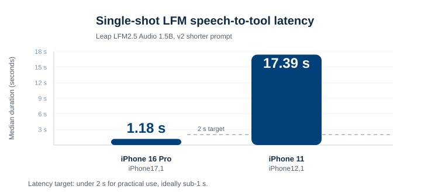
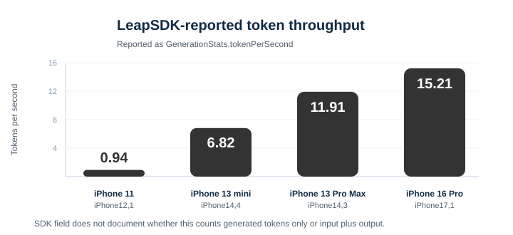
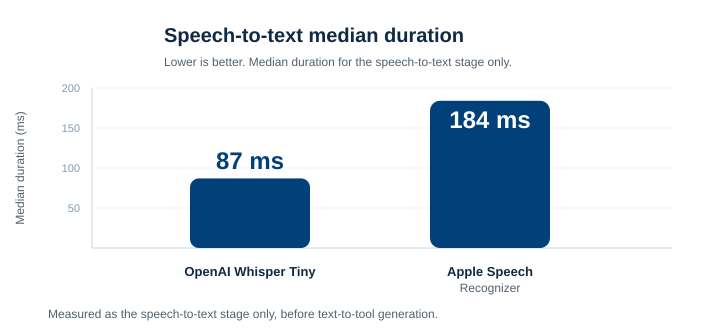
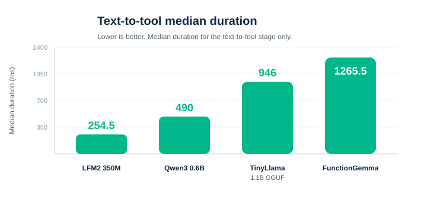
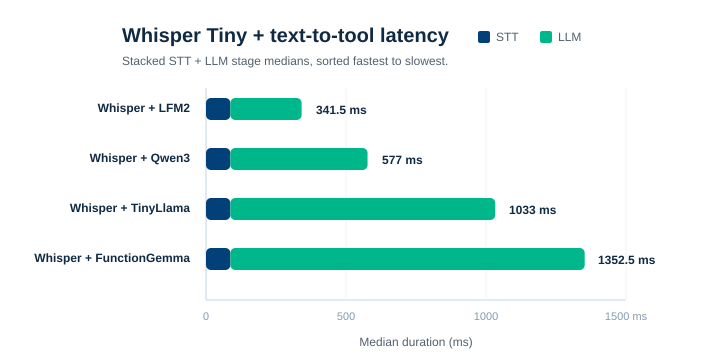
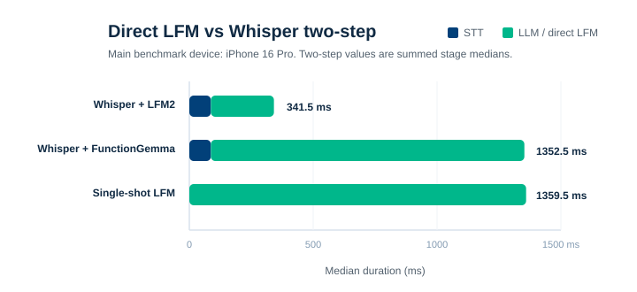

<table>
  <tr>
    <td style="border: 0; padding: 0 32px 0 0; vertical-align: top;">
      
    </td>
    <td style="border: 0; padding: 0; text-align: left; vertical-align: top;">
      <strong>Authors:</strong> 
      Duda Piotr 
      Kędzierski Wojciech 
      Kołakowski Damian
    </td>
  </tr>
</table>

# Speech-to-Tool Benchmark

I’m running a benchmark to compare two approaches for turning spoken user intent into tool calls:

1. **Direct, single-step speech-to-tool**
2. **Two-step speech-to-text, then text-to-tool**

The core question is simple:

> Which approach is faster and more practical when running on-device inside an iOS app?

## Why this matters

For voice-first interfaces, latency matters a lot. Even small delays can make an assistant feel less responsive, especially when the goal is to trigger an action rather than produce a long-form answer.

For this benchmark, I arbitrarily use **1.5 seconds** as the practical latency baseline for assuming a voice-to-action feature is usable.

In this benchmark, I want to focus on the fastest possible inference path for short spoken commands.

## Methodology

The benchmark runs inside an iOS app.

The Swift WildEdge SDK reports processing-time measurements to our backend.

WildEdge also provides remote configuration, so prompts and selected models can be changed dynamically between benchmark runs.

Audio is provided as `.m4a` files and converted to the supported format outside of the measured time, so the measured latency focuses on inference and tool-call preparation rather than preprocessing.

This benchmark focuses on latency, not model accuracy. I do not measure the model’s general tool-calling accuracy here. Latency results are reported only for runs where the generated output matches the expected tool call. In this test set, that output match rate is 100%, but that should not be read as the model’s general accuracy. It only means the latency numbers are based on valid outputs for these benchmark cases.

The measurements cover:

1. **Direct speech-to-tool latency:** median processing time for the direct speech-to-tool run.
2. **Speech-to-text, then text-to-tool latency:** sum of two medians:
   - speech-to-text median processing time
   - text-to-tool median processing time

### What this benchmark does not focus on

- **Accuracy:** this is not an accuracy benchmark. The test data is intentionally simple, and all evaluated models matched the expected outputs for these cases. That should not be read as broad tool-calling accuracy.
- **Prompt engineering:** longer prompts visibly affected processing time. I shortened and optimized the direct prompt for this run, but there is still room for further prompt work.
- **Fine-tuning:** this benchmark does not evaluate fine-tuned models. The goal is to get a practical ballpark comparison between the one-step direct speech-to-tool path and the two-step speech-to-text -> text-to-tool path.

## Hardware

The main benchmark device is:

- **iPhone 16 Pro** as the primary target device

The other devices are control devices used to verify the performance trend across Apple hardware generations:

- **iPhone 13 Pro Max** and **iPhone 13 mini** as mid-generation comparisons
- **iPhone 11** as a baseline older-device comparison

## Test set

The benchmark uses:

- 9 `.m4a` voice recordings across two voices: A and B
- Short commands
- English language input from non-native English speakers
- Tool-oriented user intents, with JSON tool-call output as the expected final result

## Approaches compared

For both approaches:

- No streaming. Each run starts after the full speech file is recorded.
- The input is a full `.m4a` file recorded with the iPhone built-in microphone.
- I intentionally process the full file first to avoid premature streaming optimization.
- No models are fine-tuned.
- The test files are easy for speech recognition, so near-100% STT accuracy is not the point of this benchmark.
- Text-to-tool prompts include a hint to return valid JSON tool-call output. Prompts are lightly adapted per model while keeping similar length.

### 1. Direct speech-to-tool

The model receives speech input and directly produces the tool call.

```mermaid
%%{init: {"theme": "base", "themeVariables": {"background": "#ffffff", "fontFamily": "Arial, sans-serif", "primaryColor": "#00b78b", "primaryTextColor": "#ffffff", "primaryBorderColor": "#00b78b", "lineColor": "#9fb3c8", "textColor": "#102a43", "taskBkgColor": "#00b78b", "taskTextColor": "#ffffff", "taskBorderColor": "#00b78b", "gridColor": "#f0f4f8", "sectionBkgColor": "#eefaf6", "altSectionBkgColor": "#f7fbfd", "titleColor": "#102a43"}, "themeCSS": ".tick text { display: none; } .grid .tick line { stroke: #f0f4f8; } .task0 { fill: #00b78b !important; stroke: #00b78b !important; } .taskText { fill: #ffffff; font-weight: 700; } .taskTextOutsideRight, .taskTextOutsideLeft { fill: #102a43; font-weight: 700; } .sectionTitle, .titleText { fill: #102a43; font-weight: 700; }"}}%%
gantt
    title Direct speech-to-tool latency
    dateFormat X
    tickInterval 1second
    section Direct path
    Speech-to-tool :direct, 0, 1s
```

This avoids an explicit intermediate transcript step, which may reduce latency and simplify the pipeline.

### 2. Speech-to-text, then text-to-tool

The speech input is first transcribed into text. That text is then passed to a second step that generates the tool call.

```mermaid
%%{init: {"theme": "base", "themeVariables": {"background": "#ffffff", "fontFamily": "Arial, sans-serif", "primaryColor": "#024079", "primaryTextColor": "#ffffff", "primaryBorderColor": "#024079", "secondaryColor": "#00b78b", "lineColor": "#9fb3c8", "textColor": "#102a43", "taskBkgColor": "#024079", "taskTextColor": "#ffffff", "taskBorderColor": "#024079", "gridColor": "#f0f4f8", "sectionBkgColor": "#f7fbfd", "altSectionBkgColor": "#eefaf6", "titleColor": "#102a43"}, "themeCSS": ".tick text { display: none; } .grid .tick line { stroke: #f0f4f8; } .task0 { fill: #024079 !important; stroke: #024079 !important; } .task1 { fill: #00b78b !important; stroke: #00b78b !important; } .taskText { fill: #ffffff; font-weight: 700; } .taskTextOutsideRight, .taskTextOutsideLeft { fill: #102a43; font-weight: 700; } .sectionTitle, .titleText { fill: #102a43; font-weight: 700; }"}}%%
gantt
    title Two-step speech-to-tool latency
    dateFormat X
    tickInterval 1second
    section Two-step flow
    Speech-to-text :stt, 0, 1s
    Text-to-tool :ttt, after stt, 1s
```

This approach may be easier to debug and inspect, but it adds another stage to the pipeline.

## Single-shot LFM speech-to-tool results

I now have direct speech-to-tool results across four devices: iPhone 16 Pro, iPhone 13 Pro Max, iPhone 13 mini, and iPhone 11.

This run includes LeapSDK token-speed metadata, so it gives the current concrete baseline for the direct path across iPhone generations.

For this run, the direct speech-to-tool path is producing a valid tool-call JSON in about **1.36 seconds median** on iPhone 16 Pro (`iPhone17,1`) and **1.46 seconds median** on iPhone 13 Pro Max (`iPhone14,3`). Both are inside my arbitrary practical target of roughly **1.5 seconds**, though the preferred target for this interaction is still **sub-1 second**.

The iPhone 13 mini (`iPhone14,4`) lands at **2.66 seconds median**. That is outside the arbitrary 1.5-second target, but still much closer to the practical range than the iPhone 11 (`iPhone12,1`) baseline at **17.39 seconds median**.

For throughput, LeapSDK reports **15.21 tokens/s** on iPhone 16 Pro, **11.91 tokens/s** on iPhone 13 Pro Max, **6.82 tokens/s** on iPhone 13 mini, and **0.94 tokens/s** on iPhone 11. I’m treating this as SDK-reported token throughput because the exposed `GenerationStats.tokenPerSecond` field does not document whether it counts generated tokens only or input plus output tokens.

The hardware-progress story is clear here. The iPhone 16 Pro is about **12.8× faster** than iPhone 11 on median latency and about **16.1× higher** on SDK-reported token throughput. In practical terms, this is where Apple’s Neural Engine progress shows up: the same local speech-to-tool interaction goes from not practical on iPhone 11 to usable on newer Pro hardware.

## Speech-to-text results

I also measured the **speech-to-text** part of the two-step pipeline.

Current median durations:

| Rank | Model | Median duration |
|---:|---|---:|
| 1 | OpenAI Whisper Tiny | 87 ms |
| 2 | Apple Speech Recognizer | 184 ms |

OpenAI Whisper Tiny is currently the fastest speech-to-text result at **87 ms median**. Apple Speech Recognizer is **184 ms median**, about **2.1× slower**, but still very fast compared with the generation-heavy parts of the pipeline.

## Text-to-tool results

I also measured the **text-to-tool** part of the pipeline.

Current median durations:

| Rank | Model | Median duration |
|---:|---|---:|
| 1 | LFM2 350M Text To Tool | 254.5 ms |
| 2 | Qwen3 0.6B 4-bit Text To Tool | 490 ms |
| 3 | TinyLlama 1.1B 4-bit GGUF Text To Tool | 946 ms |
| 4 | FunctionGemma Text To Tool | 1265.5 ms |

## Combined two-step results

Because OpenAI Whisper Tiny is about **2.1× faster** than Apple Speech Recognizer in this run, I’m focusing the combined two-step estimate on Whisper Tiny plus each text-to-tool model.

These are **summed stage medians**, not full paired end-to-end runs. They do not include orchestration overhead between the transcript and tool-call generation steps.

| Rank | STT model | LLM model | STT median duration | LLM median duration | Total median duration |
|---:|---|---|---:|---:|---:|
| 1 | OpenAI Whisper Tiny | LFM2 350M Text To Tool | 87 ms | 254.5 ms | 341.5 ms |
| 2 | OpenAI Whisper Tiny | Qwen3 0.6B 4-bit Text To Tool | 87 ms | 490 ms | 577 ms |
| 3 | OpenAI Whisper Tiny | TinyLlama 1.1B 4-bit GGUF Text To Tool | 87 ms | 946 ms | 1033 ms |
| 4 | OpenAI Whisper Tiny | FunctionGemma Text To Tool | 87 ms | 1265.5 ms | 1352.5 ms |

## Observations

The text-to-tool numbers show a wide latency spread.

**LFM2 350M** is currently the fastest text-to-tool result at **254.5 ms median**, followed by **Qwen3 0.6B** at **490 ms median**.

The slowest text-to-tool result in this run is **FunctionGemma Text To Tool** at **1265.5 ms median**, which is around **5.0× slower** than the fastest model.

The practical takeaway is that smaller models and shorter prompts appear to matter a lot for this voice-to-action use case. The system still benefits from LLM-style structured output, but the prompt and model should be kept as small as the task allows.

The current stage-level numbers make the two-step path look very competitive on latency. The fastest combined estimate is **341.5 ms median** before orchestration overhead: **87 ms** for OpenAI Whisper Tiny plus **254.5 ms** for LFM2 350M Text To Tool.

The most interesting comparison is against the direct single-shot LFM speech-to-tool path on the main iPhone 16 Pro benchmark device. The fastest two-step estimate, **Whisper Tiny + LFM2 350M**, is about **4.0× faster** than single-shot LFM. But the slowest Whisper-based combination here, **Whisper Tiny + FunctionGemma**, is still almost identical to the direct LFM result: **1352.5 ms** vs **1359.5 ms**.

That is not the same as a full paired end-to-end two-step run yet, but it gives a useful input for the next direct comparison:

- direct speech-to-tool latency
- speech-to-text stage latency
- text-to-tool stage latency
- full speech-to-text followed by text-to-tool latency

## What I want to measure next

The main focus is latency:

- How fast can each approach produce a valid tool call?
- How much does device generation matter?
- Is the direct path meaningfully faster?
- Does the two-step approach provide better reliability or easier debugging?

## Next step

I’ll use this four-device paired latency/token-speed view as the baseline, keeping iPhone 16 Pro as the primary target and iPhone 11 as an older-device stress baseline.

The next step is to run full paired end-to-end two-step measurements, including orchestration overhead, and compare them directly against the single-shot speech-to-tool path.

#SpeechToText #VoiceAI #OnDeviceAI #iOSDevelopment #AIEngineering #Benchmarking
